# Hotelio C4 Container Diagram

This document contains the C4 Container diagram for the Hotelio system architecture.

## Architecture Overview

This C4 Container diagram illustrates the Hotelio system architecture, showing the transition from a monolithic backend to a microservice-oriented architecture using the Strangler Fig pattern.

## Diagram

```mermaid
graph TB
    %% External Users
    Browser[("🌐 Browser")]
    Mobile[("📱 Mobile App")]
    
    %% Frontend Layer
    Frontend["Frontend"]
    
    %% Routing Layer
    Router["API Gateway"]
    
    %% Monolithic Backend
    subgraph Monolith["🏢 Hotelio Monolith Backend"]
        AppUserService["App User Service"]
        BookingService["Booking Service"]
        HotelService["Hotel Service"]
        ReviewService["Review Service"]
        PromoCodeService["Promo Code Service"]
    end
    
    %% Extracted Microservices
    ProductService["🏨 Hotel Service"]
    
    %% Databases
    MainDB[("🗄️ Monolith Database")]
    ProductDB[("🗄️ Hotel Service Database")]
    
    %% User Interactions
    Browser --> Frontend
    Mobile --> Frontend
    Frontend --> Router
    
    %% Routing to Services
    Router --> AppUserService
    Router --> BookingService
    Router --> HotelService
    Router --> ReviewService
    Router --> PromoCodeService
    Router --> ProductService
    
    %% Internal Monolith Dependencies
    AppUserService --> BookingService
    HotelService --> BookingService
    ReviewService --> BookingService
    PromoCodeService --> AppUserService
    
    %% Database Connections
    Monolith --> MainDB
    ProductService --> ProductDB
    
    %% Styling
    classDef userClass fill:#e1f5fe,stroke:#01579b,stroke-width:2px
    classDef frontendClass fill:#f3e5f5,stroke:#4a148c,stroke-width:2px
    classDef routingClass fill:#fff3e0,stroke:#e65100,stroke-width:2px
    classDef monolithClass fill:#e8f5e8,stroke:#2e7d32,stroke-width:2px
    classDef serviceClass fill:#fff8e1,stroke:#f57f17,stroke-width:2px
    classDef dbClass fill:#fce4ec,stroke:#c2185b,stroke-width:2px
    
    class Browser,Mobile userClass
    class Frontend frontendClass
    class Router routingClass
    class AppUserService,BookingService,HotelService,ReviewService,PromoCodeService monolithClass
    class ProductService serviceClass
    class MainDB,ProductDB dbClass
```

## Key Components

- **External Users:** Browser and Mobile App clients
- **Frontend:** Single-page application
- **API Gateway:** Central routing component for request distribution
- **Hotelio Monolith Backend:** Contains 5 core services:
  - **App User Service:** User Management Logic
  - **Booking Service:** Booking Processing Logic (Central Service)
  - **Hotel Service:** Hotel Management Logic
  - **Review Service:** Review Processing Logic
  - **Promo Code Service:** Promo Validation Logic
- **Extracted Microservices:** Hotel Service (Hotel Information Service)
- **Databases:** Two separate PostgreSQL databases (monolith database and hotel service database)

## Service Dependencies

- **App User Service** → **Booking Service**
- **Hotel Service** → **Booking Service**
- **Review Service** → **Booking Service**
- **Promo Code Service** → **App User Service**

*Note: Booking Service acts as a central hub, being used by App User, Hotel, and Review services. Promo Code Service depends on App User Service for user validation.*

## Architecture Patterns

- **Strangler Fig Pattern:** Gradual migration from monolith to microservices
- **Database per Service:** Each microservice has its own dedicated database
- **API Gateway Pattern:** Central routing for request distribution
- **Service Extraction:** Independent services for specific business domains
- **Controller-Service Pattern:** Clear separation between API layer and business logic